# Hi, I'm Debayan 👋

  

  <b>Computer Science Student (AI & ML) · Aspiring Software Developer · AI/ML Enthusiast</b>

  🤖 AI & Machine Learning &nbsp;·&nbsp; 🐍 Python &nbsp;·&nbsp; 🌐 Web Development
  &nbsp;·&nbsp; 🔥 Firebase &nbsp;·&nbsp; 🎨 UI/UX

I'm a Computer Science student at **Kalinga Institute of Industrial Technology (KIIT)**, passionate about software development, artificial intelligence, and building practical solutions. I enjoy turning ideas into projects while continually improving my programming and development skills.

---

## 🚀 What I'm Exploring

- 🤖 Artificial intelligence and machine learning
- 💻 Software and web development
- 🎨 UI/UX and user-focused design
- 🧩 Problem solving and software engineering

## 🎓 Education

**Computer Science (AI & ML)** — Kalinga Institute of Industrial Technology (KIIT)

## 🧩 Featured Project

### 💜 SkillSwap — Peer-to-Peer Learning Platform
[Open SkillSwap](https://joyful-blini-599dc7.netlify.app)

A platform where students share skills, teach what they know, and use Skill Credits to learn something new.

- Discover skills across programming, design, music, and languages
- Teach and learn through sessions using Skill Credits
- Community features include posts, comments, messages, and notifications
- **HTML · CSS · JavaScript · Tailwind CSS · Supabase**

## 🛠️ Tech Stack

      

     

`Git` `GitHub` `AI/ML` `Web Development` `UI/UX` `Problem Solving` `Software Engineering`

## 🌱 Currently

- Strengthening my foundations in Python, AI/ML, and software development
- Building projects to gain hands-on experience
- Exploring AI and machine learning
- Learning new technologies and development tools
- Open to collaboration, learning, and exciting projects

## 🎯 My Goal

To become a well-rounded software engineer with strong expertise in AI/ML and modern software development, while building technology that solves real-world problems.

---

## 📊 GitHub Activity

  
   
  
   
  

## 🌐 Socials

  
  
  
  
  
  
  

> **Keep learning. Build useful things. Make ideas real.**
